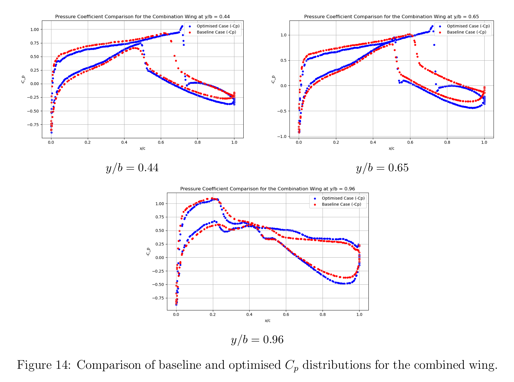

# FYP: Adjoint-Based Shape Optimization of Custom 3D Wings

## Objectives
- Perform 3D aerodynamic shape optimization using SU2's discrete adjoint solver for 4 different custom wing designs.
- Apply Free-Form Deformation (FFD) to custom wing geometries.
- Enforce spanwise thickness constraints and fixed lift constraint throughout SU2 numerical setup.
- Evaluate performance improvements based on drag reduction and L/D ratio.

## Tools Used
- **SU2**: Euler-based adjoint optimization with discrete adjoint method.
- **Pointwise**: Mesh generation tailored for inviscid flow (coarse boundary layer).
- **ParaView**: Visualize shockwaves, Cp distribution, and Mach contours.

## Key Achievements
- Reduced drag by up to **76%** for the NACA0012 wing while maintaining fixed lift.
- Improved aerodynamic efficiency (L/D) by over **4x** in the most successful case.
- Optimized four custom 3D wing designs: NACA0012, NACA SC 0714, RAE2822, and a Combined airfoil wing.
- Tuned SU2 configuration parameters (e.g., gradient factor, relaxation, solver iterations) to achieve convergence across complex geometries.
- Demonstrated effectiveness of adjoint-based FFD optimization for practical wing design scenarios under transonic conditions.

## Figures

### 1. NACA 0012 wing optimisation results

### 1. NACA SC 0714 wing optimisation results

### 1. RAE 2822 wing optimisation results

### 1. Combined airfoil wing optimisation results

### 3. Summary of results

