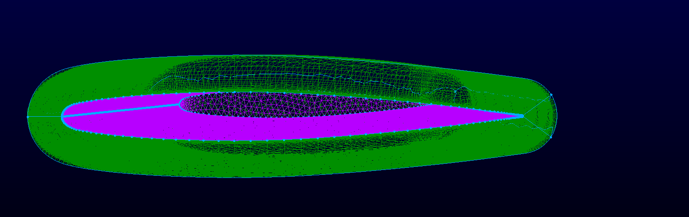

# UROP3200: Turbulence Model Analysis for 3D Transonic Wing Simulation

## Objectives
- Conduct mesh refinement study to assess accuracy and computational efficiency.
- Simulate 3D transonic flow over the ONERA M6 wing using SU2.
- Compare the effect of different turbulence models (Spalart-Allmaras vs SST).
- Validate pressure coefficient distributions against experimental data.

## Tools Used
- **SU2**: 3D RANS simulations with multiple turbulence models.
- **Pointwise**: High-quality structured and hybrid mesh generation.
- **ParaView**: Post-processing (Cp plots at spanwise stations, shock prediction).

## Key Achievements
- Successfully simulated shockwave formation and pressure distributions on the ONERA M6 wing.
- Demonstrated that the SST turbulence model better captured shock location and strength near mid-span.
- Performed grid convergence study to ensure mesh independence of Cp results.
- Built a validated CFD setup suitable for transonic wing benchmarking.

## Figures

### 1. Meshing

### 2. Mesh convergence test

### 3. Turbulence model comparison

